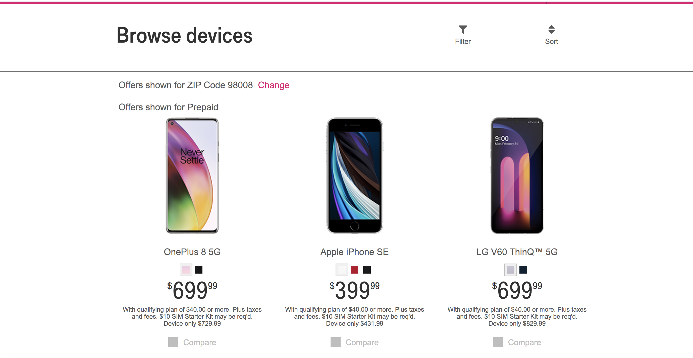
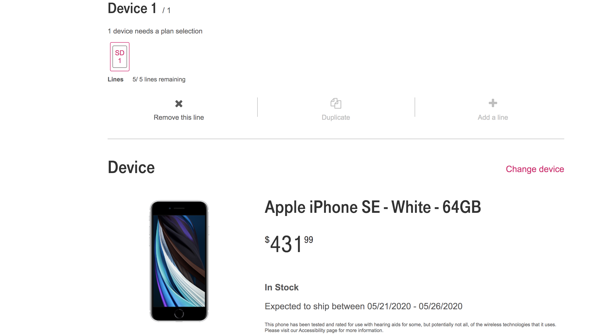

# Introduction

I'm graduated from [Lingaya's Institute of Management And Technology](http://www.limat.org/) with Bachelors in Electronics and Communication.Currently working as a Senior Software Developer in [Accenture](https://www.accenture.com/us-en/about/company/united-states)

## Experience

Experienced working in multiple programming languages, tools & technologies .I have worked on various projects in [Accenture](https://www.accenture.com/us-en/about/company/united-states)

## Skills
- **Frameworks**: Angular JS 1.3 -1.6, Angular JS 2.0- 7.0, NodeJS.
- **Languages**: HTML5, CSS, JavaScript( ES 5, ES 6), TypeScript, UNIX Shell scripting, Java/J2EE,Hibernate,C, 
- **Database**: Oracle, MySQL 
- **Tools**: MS Visual Studio, VS Code, WebStorm, Eclipse, IntelliJ, Phabricator, Documentum, Jenkins, Performance Monitoring   Tools, Debugging Tools (Firebug, Chrome Dev Tool, Fiddler, Charles).
- **Libraries**: Webpack, browserify, Grunt, underscore, JQuery, Bootstrap,Gulp.
- **Version Control**: GIT, SVN UnitTesting:Jasmine,Karma,Mocha,Chai,Protractor

## Project Snapshots

Worked on similar kind of project where application interface is created in a way that it can be used by Retailer , customer representative or customer to do shopping.

### Contact

You can contact me at Srishti2490 AT hotmail Dot com

